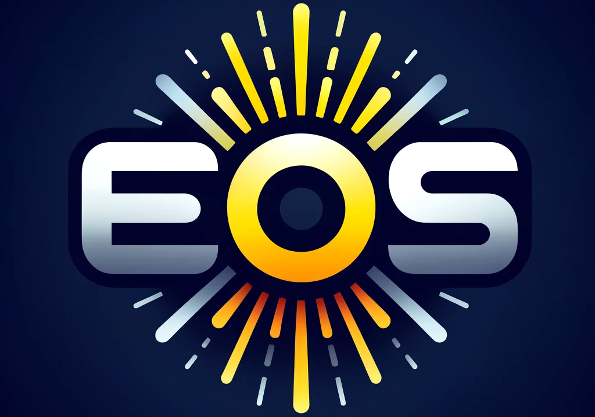

<p align="center">
    
</p>

<h1 align="center">The Experiment Orchestration System (EOS)</h1>


> **Note:** EOS is currently in the alpha development stage. Much additional functionality and enhancements are planned.
> It currently has a core feature set to use for research. Please report any issues, make feature requests, or contribute to development!

The Experiment Orchestration System (EOS) is a comprehensive software framework and runtime for laboratory automation, designed
to serve as the foundation for one or more automated or self-driving labs (SDLs).

EOS provides:

* A common framework to implement laboratory automation
* A plugin system for defining labs, devices, experiments, tasks, and optimizers
* A package system for sharing and reusing code and resources across the community
* Extensive static and dynamic validation of experiments, task parameters, and more
* A runtime for executing tasks, experiments, and experiment campaigns
* A central authoritative orchestrator that can communicate with and control multiple devices
* Distributed task execution and optimization using the Ray framework
* Built-in Bayesian experiment parameter optimization
* Optimized task scheduling
* Device and sample container allocation system to prevent conflicts
* Result aggregation such as automatic output file storage

## Installation

### 1. Install PDM

PDM is used as the project manager for EOS, making it easier to install dependencies and build it.

#### Linux/Mac

```shell
curl -sSL https://pdm-project.org/install-pdm.py | python3 -
```

#### Windows

```shell
(Invoke-WebRequest -Uri https://pdm-project.org/install-pdm.py -UseBasicParsing).Content | py -
```

### 2. Clone the EOS Repository

```shell
git clone https://github.com/UNC-Robotics/eos
```

### 3. Install Dependencies

Navigate to the cloned repository and run:

```shell
pdm install
```

(Optional) If you wish to contribute to EOS development:

```shell
pdm install -G dev
```

(Optional) If you also wish to contribute to the EOS documentation:

```shell
pdm install -G docs
```

## Configuration

After installation, you need to configure external services such as MongoDB and MinIO as well as EOS itself.

### 1. Configure External Services

We provide a Docker Compose file that can run all external services for you.

Copy the example environment file:

```shell
cp docker/.env.example docker/.env
```

Edit `docker/.env` and provide values for all fields.

### 2. Configure EOS

EOS reads parameters from a YAML configuration file.

Copy the example configuration file:

```shell
cp config.example.yml config.yml
```

Edit `config.yml`. Ensure that credentials are provided for the MongoDB and MinIO services.

## Running
### 1. Start External Services

```shell
cd docker
docker compose up -d
```

### 2. Source the Virtual Environment

```shell
source env/bin/activate
```

### 3. Start the EOS Orchestrator

```shell
eos orchestrator
```

### 4. Start the EOS REST API

```shell
eos api
```
