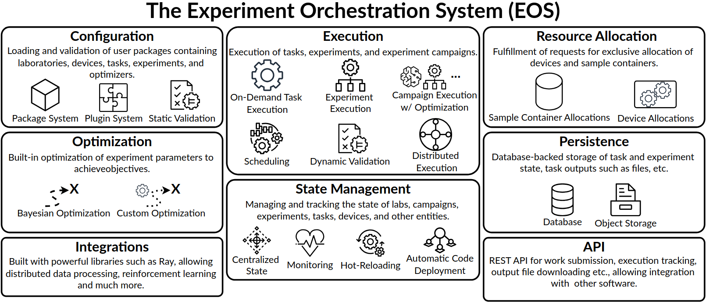

The Experiment Orchestration System (EOS)
=========================================

.. note::

    EOS is actively being developed.
    Much additional functionality and enhancements are planned. It currently has a core feature set to use for research.
    Please report any issues, make feature requests, or contribute to development!

The Experiment Orchestration System (EOS) is a comprehensive software framework and runtime for laboratory automation, designed
to serve as the foundation for one or more automated or self-driving labs (SDLs).

EOS provides:

* A common framework to implement laboratory automation
* A plugin system for defining labs, devices, experiments, tasks, and optimizers
* A package system for sharing and reusing code and resources across the community
* Extensive static and dynamic validation of experiments, task parameters, and more
* A runtime for executing tasks, experiments, and experiment campaigns
* A central authoritative orchestrator that can communicate with and control multiple devices
* Distributed task execution and optimization using the Ray framework
* Built-in Bayesian experiment parameter optimization
* Optimized task scheduling
* Device and sample container allocation system to prevent conflicts
* Result aggregation such as automatic output file storage

.. toctree::
   :caption: User Guide
   :maxdepth: 2

   user-guide/index
