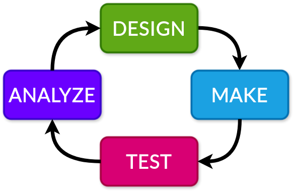

Campaigns
=========
A campaign in EOS is an experiment that is executed multiple times in sequence. The parameters of the experiments usually
differ. A campaign has some goals, such as to optimize some objectives by searching for optimal parameters.
Campaigns are the highest-level execution unit in EOS, and can be used to implement autonomous (self-driving) labs.

The DMTA loop is a common paradigm in autonomous experimentation and EOS campaigns can be used to implement it. EOS has
built-in support for running campaigns of an experiment. In addition, EOS has a built-in Bayesian optimizer that can
be used to optimize parameters.

Optimization Setup (Analyze and Design Phases)
----------------------------------------------
Both the "analyze" and "design" phases of the DMTA loop can be automated by optimizing the parameters of experiments over time.
This is natively supported by EOS through a built-in Bayesian optimizer that integrates with the campaign execution module.
It is also possible to customize the optimization to incorporate custom algorithms such as reinforcement learning.

Let's look at the color mixing experiment to see how a campaign with optimization can be set up. There are six dynamic
parameters, which are the inputs of the optimization problem:

.. code-block:: yaml

    # In the "dispense_colors" task
    cyan_volume: eos_dynamic
    magenta_volume: eos_dynamic
    yellow_volume: eos_dynamic
    black_volume: eos_dynamic

    # In the "mix_colors" task
    mixing_time: eos_dynamic
    mixing_speed: eos_dynamic

Looking at the task specification of the `score_color` task, we also see that there is an output parameter called "loss".

:bdg-primary:`task.yml`

.. code-block:: yaml

    type: Score Color
    description: Score a color based on how close it is to an expected color

    input_parameters:
      red:
        type: integer
        unit: n/a
        description: The red component of the color
      green:
        type: integer
        unit: n/a
        description: The green component of the color
      blue:
        type: integer
        unit: n/a
        description: The blue component of the color

    output_parameters:
      loss:
        type: decimal
        unit: n/a
        description: Total loss of the color compared to the expected color

Taking all these together, we see that this experiment involves selecting CMYK color component volumes, as well as a
mixing time and mixing speed and trying to minimize the loss of a synthesized color compared to an expected color.

This setup is also summarized in the `optimizer.py` file adjacent to `experiment.yml`.

:bdg-primary:`optimizer.py`

.. code-block:: python

    from typing import Type, Tuple, Dict

    from bofire.data_models.acquisition_functions.acquisition_function import qNEI
    from bofire.data_models.enum import SamplingMethodEnum
    from bofire.data_models.features.continuous import ContinuousOutput, ContinuousInput
    from bofire.data_models.objectives.identity import MinimizeObjective

    from eos.optimization.sequential_bayesian_optimizer import BayesianSequentialOptimizer
    from eos.optimization.abstract_sequential_optimizer import AbstractSequentialOptimizer

    def eos_create_campaign_optimizer() -> Tuple[Dict, Type[AbstractSequentialOptimizer]]:
        constructor_args = {
            "inputs": [
                ContinuousInput(key="dispense_colors.cyan_volume", bounds=(0, 5)),
                ContinuousInput(key="dispense_colors.magenta_volume", bounds=(0, 5)),
                ContinuousInput(key="dispense_colors.yellow_volume", bounds=(0, 5)),
                ContinuousInput(key="dispense_colors.black_volume", bounds=(0, 5)),
                ContinuousInput(key="mix_colors.mixing_time", bounds=(1, 15)),
                ContinuousInput(key="mix_colors.mixing_speed", bounds=(10, 500)),
            ],
            "outputs": [
                ContinuousOutput(key="score_color.loss", objective=MinimizeObjective(w=1.0)),
            ],
            "constraints": [],
            "acquisition_function": qNEI(),
            "num_initial_samples": 50,
            "initial_sampling_method": SamplingMethodEnum.SOBOL,
        }

        return constructor_args, BayesianSequentialOptimizer

The `eos_create_campaign_optimizer` function is used to create the optimizer for the campaign. We can
see that the inputs are composed of all the dynamic parameters in the experiment and the output is the "loss" output parameter
from the "score_color" task. The objective of the optimizer (and the campaign) is to minimize this loss.

More about optimizers can be found in the Optimizers section.

Automation Setup (Make and Test Phases)
---------------------------------------
Execution of the automation is managed by EOS. The tasks and devices must be implemented by the user. Careful setup of
the experiment is required to ensure that a campaign can be executed autonomously.

Some guidelines:

* Each experiment should be standalone and should not depend on previous experiments.
* Each experiment should leave the laboratory in a state that allows the next experiment to be executed.
* Dependencies between tasks should be minimized. A task should have a dependency on another task only if it is necessary.
* Tasks should depend on any devices that they may be interacting with, even if they are not operating them. For example,
  if a robot transfer task takes a container from device A to device B, then the robot arm and both devices A and B should be required
  devices for the task.
* Branches and loops are not supported. If these are needed, they should be encapsulated inside large tasks that may use
  many devices and may represent several steps in the experiment.
