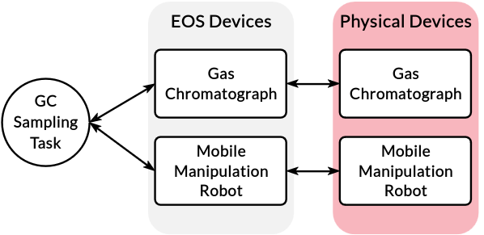

Devices
=======
In EOS, a device is an abstraction for a physical or virtual apparatus.
A device is used by one or more tasks to run some processes.
Each device in EOS is managed by a dedicated process which is created when a laboratory definition is loaded.
This process is usually implemented as a server and tasks call various functions from it.
For example, there could be a device called "magnetic mixer", which communicates with a physical magnetic mixer via
serial and provides functions such as ``start``, ``stop``, ``set_time`` and ``set_speed``.

In the figure above, we illustrate an example of devices and a task that uses these devices.
The task in this example is Gas Chromatography (GC) sampling, which is implemented with a GC and a mobile manipulation
robot for automating the sample injection with a syringe.
Both the GC and the robot are physical devices, and each has a device implementation in EOS, which runs as a persistent
process.
Then, the GC Sampling task uses both of the EOS devices to automate the sample injection process.

Most often, an EOS device will represent a physical device in the lab.
But this need not always be the case. A device in EOS can be used to represent anything that needs persistent state
throughout one or more experiments.
This could be an AI module that records inputs given to it.
Remember that a device in EOS is a persistent process.

Device Implementation
---------------------
* Devices are implemented in the `devices` subdirectory inside an EOS package
* Each device has its own subfolder (e.g., devices/magnetic_mixer)
* There are two key files per device: ``device.yml`` and ``device.py``

YAML File (device.yml)
~~~~~~~~~~~~~~~~~~~~~~
* Specifies the device type, description, and initialization parameters
* The same implementation can be used for multiple devices of the same type
* Initialization parameters can be overridden in laboratory definition

Below is an example device YAML file for a magnetic mixer:

:bdg-primary:`device.yml`

.. code-block:: yaml

    type: magnetic_mixer
    description: Magnetic mixer for mixing the contents of a container

    initialization_parameters:
      port: 5004

Python File (device.py)
~~~~~~~~~~~~~~~~~~~~~~~
* Implements device functionality
* All devices implementations must inherit from ``BaseDevice``
* The device class name must end with "Device" to be discovered by EOS

Below is a example implementation of a magnetic mixer device:

:bdg-primary:`device.py`

.. code-block:: python

    from typing import Dict, Any

    from eos.containers.entities.container import Container
    from eos.devices.base_device import BaseDevice
    from user.color_lab.common.device_client import DeviceClient

    class MagneticMixerDevice(BaseDevice):
        async def _initialize(self, initialization_parameters: Dict[str, Any]) -> None:
            port = int(initialization_parameters["port"])
            self.client = DeviceClient(port)
            self.client.open_connection()

        async def _cleanup(self) -> None:
            self.client.close_connection()

        async def _report(self) -> Dict[str, Any]:
            return {}

        def mix(self, container: Container, mixing_time: int, mixing_speed: int) -> Container:
            result = self.client.send_command("mix", {"mixing_time": mixing_time, "mixing_speed": mixing_speed})
            if result:
                container.metadata["mixing_time"] = mixing_time
                container.metadata["mixing_speed"] = mixing_speed

            return container

Let's walk through this example code:

There are functions required in every device implementation:

#. **_initialize**

   * Called when device process is created
   * Should set up necessary resources (e.g., serial connections)

#. **_cleanup**

   * Called when the device process is terminated
   * Should clean up any resources created by the device process (e.g., serial connections)

#. **_report**

   * Should return any data needed to determine the state of the device (e.g., status and feedback)

The magnetic mixer device also has the function ``mix`` for implementing the mixing operation.
This function will be called by a task to mix the contents of a container.
The ``mix`` function:

* Sends a command to lower-level driver with a specified mixing time and speed to operate the magnetic mixer
* Updates container metadata with mixing details
