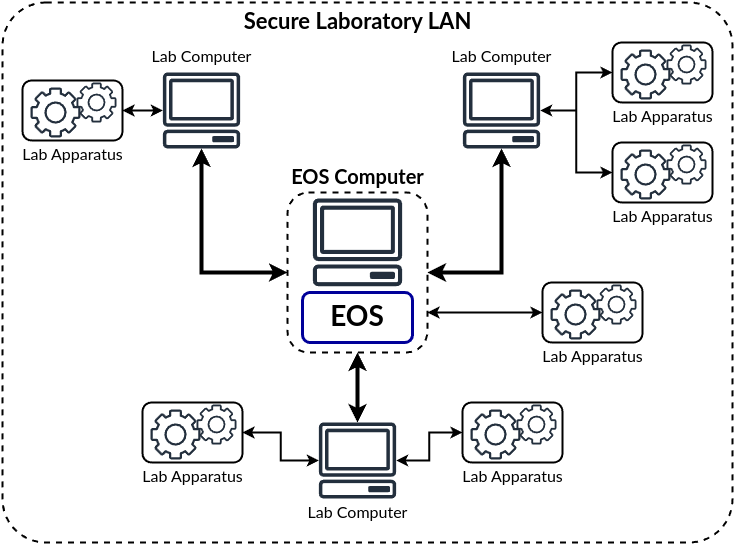

Infrastructure Setup
====================
It is critical to setup the computational and network infrastructure appropriately to ensure that EOS can access required
laboratory devices and computers as well as to ensure security.

EOS requires access to other laboratory computers that are needed to interface with laboratory apparatuses.
EOS knows what these computers are from a :doc:`laboratory YAML file <laboratories>`.

The following are important points for setting up the computational and network infrastructure for EOS:

#. EOS should be set up in an isolated or secured (appropriately firewalled) LAN to prevent unauthorized access.
#. All laboratory computers that EOS will control should be in the same LAN.
#. All laboratory computers should have a static IP address so that EOS can identify them.
#. EOS must have full bi-directional network access to the laboratory computers.
   All ports should be accessible.
   This will likely require firewall reconfiguration.
#. Power management settings may need to be altered to prevent computers from hibernating if automation will be running
   for a long time.

