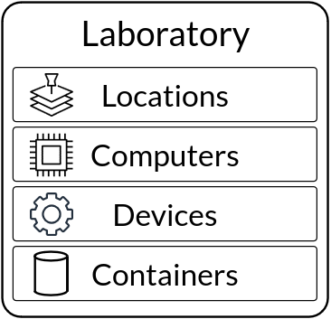
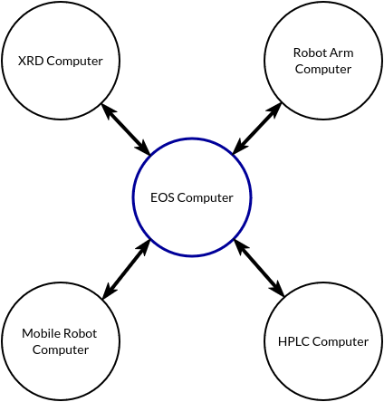

Laboratories
============
Laboratories are the space in which devices and containers exist and where tasks, experiments, and campaigns
of experiments take place.

A laboratory in EOS is a collection of:

* Locations (e.g., physical stations around the lab)
* Computers (e.g., devices capable of controlling equipment)
* Devices (e.g., equipment/apparatuses in the laboratory)
* Containers (e.g., vessels for holding samples)

Laboratory Implementation
-------------------------
* Laboratories are implemented in the `laboratories` subdirectory inside an EOS package
* Each laboratory has its own subfolder (e.g., laboratories/color_lab)
* The laboratory is defined in a YAML file named `laboratory.yml`

Below is an example laboratory YAML file for a solar cell fabrication lab:

:bdg-primary:`lab.yml`

.. code-block:: yaml

    type: solar_cell_fabrication_lab
    description: A laboratory for fabricating and characterizing perovskite solar cells

    locations:
      glovebox:
        description: Nitrogen-filled glovebox
        metadata:
            map_coordinates:
                x: 10
                y: 20
                theta: 0
      fume_hood:
        description: Fume hood for solution preparation and coating
      annealing_station:
        description: Hotplate for thermal annealing
      evaporation_chamber:
        description: Thermal evaporation chamber for electrode deposition
      characterization_room:
        description: Room for solar cell performance testing

    computers:
      xrd_computer:
        description: XRD system control and data analysis
        ip: 192.168.1.101
      solar_sim_computer:
        description: Solar simulator control and J-V measurements
        ip: 192.168.1.102
      robot_computer:
        description: Mobile manipulation robot control
        ip: 192.168.1.103

    devices:
      spin_coater:
        description: Spin coater for depositing perovskite and transport layers
        type: spin_coater
        location: glovebox
        computer: eos_computer

      uv_ozone_cleaner:
        description: UV-Ozone cleaner for substrate treatment
        type: uv_ozone_cleaner
        location: fume_hood
        computer: eos_computer

      thermal_evaporator:
        description: Thermal evaporator for metal electrode deposition
        type: thermal_evaporator
        location: evaporation_chamber
        computer: eos_computer
        initialization_parameters:
          max_temperature: 1000C
          materials: [Au, Ag, Al]

      solar_simulator:
        description: Solar simulator for J-V curve measurements
        type: solar_simulator
        location: characterization_room
        computer: solar_sim_computer
        initialization_parameters:
          spectrum: AM1.5G
          intensity: 100mW/cm2

      xrd_system:
        description: X-ray diffractometer for crystal structure analysis
        type: xrd
        location: characterization_room
        computer: xrd_computer

      mobile_robot:
        description: Mobile manipulation robot for automated sample transfer
        type: mobile_robot
        location: characterization_room
        computer: robot_computer
        initialization_parameters:
          locations:
            - glovebox
            - fume_hood
            - annealing_station
            - evaporation_chamber
            - characterization_room

    containers:
      - type: vial
        location: glovebox
        metadata:
          solvent: 20 #ml
        ids:
          - precursor_vial_1
          - precursor_vial_2
          - precursor_vial_3

      - type: petri_dish
        location: glovebox
        metadata:
          capacity: 100 #ml
        ids:
          - substrate_dish_1
          - substrate_dish_2

      - type: crucible
        location: evaporation_chamber
        metadata:
          capacity: 5 #ml
        ids:
          - au_crucible
          - ag_crucible

Locations (Optional)
""""""""""""""""""""
Locations are physical stations around the lab where devices and containers are placed. They are defined in the
`locations` section of the laboratory YAML file. You can define metadata for each location, such as map coordinates
for a mobile robot. Defining locations is optional.

.. code-block:: yaml

    locations:
      glovebox:
        description: Nitrogen-filled glovebox
        metadata:
            map_coordinates:
                x: 10
                y: 20
                theta: 0
      fume_hood:
        description: Fume hood for solution preparation and coating
      annealing_station:
        description: Hotplate for thermal annealing
      evaporation_chamber:
        description: Thermal evaporation chamber for electrode deposition
      characterization_room:
        description: Room for solar cell performance testing

Computers (Optional)
""""""""""""""""""""
Computers control devices and host EOS devices. Each computer that is required to interface with one or
more devices must be defined in this section. The IP address of each computer must be specified.

There is always a computer in each lab called **eos_computer** that has the IP "127.0.0.1". This computer is the computer
that runs the EOS orchestrator, and can be thought of as the "central" computer. No other computer named "eos_computer"
is allowed, and no other computer can have the IP "127.0.0.1". The "computers" section need not be defined unless
additional computers are required (e.g., if not all devices are connected to eos_computer).

.. code-block:: yaml

    computers:
      xrd_computer:
        description: XRD system control and data analysis
        ip: 192.168.1.101
      solar_sim_computer:
        description: Solar simulator control and J-V measurements
        ip: 192.168.1.102
      robot_computer:
        description: Mobile manipulation robot control
        ip: 192.168.1.103

Devices (Required)
""""""""""""""""""
Devices are equipment or apparatuses in the laboratory that are required to perform tasks. Each device must have a unique
name inside the lab and must be defined in the `devices` section of the laboratory YAML file.

.. code-block:: yaml

    devices:
      spin_coater:
        description: Spin coater for depositing perovskite and transport layers
        type: spin_coater
        location: glovebox
        computer: eos_computer

      uv_ozone_cleaner:
        description: UV-Ozone cleaner for substrate treatment
        type: uv_ozone_cleaner
        location: fume_hood
        computer: eos_computer

      thermal_evaporator:
        description: Thermal evaporator for metal electrode deposition
        type: thermal_evaporator
        location: evaporation_chamber
        computer: eos_computer
        initialization_parameters:
          max_temperature: 1000C
          materials: [Au, Ag, Al]

**type**: Every device must have a type, which matches a device specification (e.g., defined in the `devices` subdirectory
of an EOS package). There can be multiple devices with different names of the same type.

**location** (optional): The location where the device is at.

**computer**: The computer that controls the device. If not "eos_computer", the computer must be defined in the
"computers" section.

**initialization_parameters** (optional): Parameters required to initialize the device. These parameters are defined
in the device specification and can be overridden here.

Containers (Optional)
"""""""""""""""""""""
Containers are vessels for holding samples and are how samples go around the lab (e.g., for batch processing). They are
defined in the `containers` section of the laboratory YAML file.

.. code-block:: yaml

    containers:
      - type: vial
        location: glovebox
        metadata:
          capacity: 20 #ml
        ids:
          - precursor_vial_1
          - precursor_vial_2
          - precursor_vial_3

      - type: petri_dish
        location: glovebox
        metadata:
          capacity: 100 #ml
        ids:
          - substrate_dish_1
          - substrate_dish_2

      - type: crucible
        location: evaporation_chamber
        metadata:
          capacity: 5 #ml
        ids:
          - au_crucible
          - ag_crucible

**type**: Every container must have a type, which can be used to group together containers of the same type.

**location** (optional): The location where the container starts out at.

**metadata** (optional): Any additional information about the container, such as its capacity or contained sample.

**ids**: A list of unique identifiers for each container. These are used to identify and refer to specific containers.
