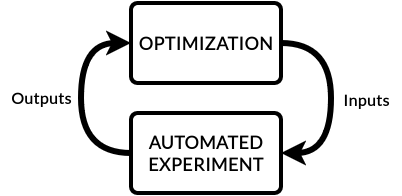

Optimizers
==========
Optimizers are key to building an autonomous laboratory.
In EOS, optimizers give intelligence to experiment campaigns by optimizing task parameters to achieve objectives over time.
Optimizers in EOS are *sequential*, meaning they iteratively optimize parameters by drawing insights from previous experiments.
One of the most common sequential optimization methods is **Bayesian optimization**, and is especially useful for
optimizing expensive-to-evaluate black box functions.

EOS has a built-in Bayesian optimizer powered by `BoFire <https://experimental-design.github.io/bofire/>`_
(based on `BoTorch <https://botorch.org/>`_).
This optimizer supports both constrained single-objective and multi-objective Bayesian optimization.
It offers several different surrogate models, including Gaussian Processes (GPs) and Multi-Layer Perceptrons (MLPs),
along with various acquisition functions.

Distributed Execution
---------------------
EOS optimizers are created in a dedicated Ray actor process.
This actor process can be created in any computer with an active Ray worker.
This can enable running the optimizer on a more capable computer than the one running the EOS orchestrator.

Optimizer Implementation
------------------------
EOS optimizers are defined in the ``optimizer.py`` file adjacent to ``experiment.yml`` in an EOS package.
Below is an example:

:bdg-primary:`optimizer.py`

.. code-block:: python

    from bofire.data_models.acquisition_functions.acquisition_function import qNEI
    from bofire.data_models.enum import SamplingMethodEnum
    from bofire.data_models.features.continuous import ContinuousOutput, ContinuousInput
    from bofire.data_models.objectives.identity import MinimizeObjective

    from eos.optimization.sequential_bayesian_optimizer import BayesianSequentialOptimizer
    from eos.optimization.abstract_sequential_optimizer import AbstractSequentialOptimizer

    def eos_create_campaign_optimizer() -> tuple[dict, type[AbstractSequentialOptimizer]]:
        constructor_args = {
            "inputs": [
                ContinuousInput(key="dispense_colors.cyan_volume", bounds=(0, 5)),
                ContinuousInput(key="dispense_colors.magenta_volume", bounds=(0, 5)),
                ContinuousInput(key="dispense_colors.yellow_volume", bounds=(0, 5)),
                ContinuousInput(key="dispense_colors.black_volume", bounds=(0, 5)),
                ContinuousInput(key="mix_colors.mixing_time", bounds=(1, 15)),
                ContinuousInput(key="mix_colors.mixing_speed", bounds=(10, 500)),
            ],
            "outputs": [
                ContinuousOutput(key="score_color.loss", objective=MinimizeObjective(w=1.0)),
            ],
            "constraints": [],
            "acquisition_function": qNEI(),
            "num_initial_samples": 50,
            "initial_sampling_method": SamplingMethodEnum.SOBOL,
        }

        return constructor_args, BayesianSequentialOptimizer

Each ``optimizer.py`` file must contain the function ``eos_create_campaign_optimizer``.
This function must return:

#. The constructor arguments to make an optimizer class instance
#. The class type of the optimizer

In this example, we use EOS' built-in Bayesian optimizer.
However, it is also possible to define custom optimizers in this file, and simply return the constructor arguments and
the class type from ``eos_create_campaign_optimizer``.

.. note::
    All optimizers must inherit from the class ``AbstractSequentialOptimizer`` under the ``eos.optimization`` module.

Input and Output Parameter Naming
"""""""""""""""""""""""""""""""""
The names of input and output parameters must reference task parameters.
The EOS reference format must be used:

**TASK.PARAMETER_NAME**

This is necessary for EOS to be able to associate the optimizer with the experiment tasks and to forward parameter values
where needed.

Example Custom Optimizer
------------------------
Below is an example of a custom optimizer implementation that randomly samples parameters for the same color mixing problem:

:bdg-primary:`optimizer.py`

.. code-block:: python

    import random
    from dataclasses import dataclass
    from enum import Enum
    import pandas as pd

    from eos.optimization.abstract_sequential_optimizer import AbstractSequentialOptimizer

    class ObjectiveType(Enum):
        MINIMIZE = 1
        MAXIMIZE = 2

    @dataclass
    class Parameter:
        name: str
        lower_bound: float
        upper_bound: float

    @dataclass
    class Metric:
        name: str
        objective: ObjectiveType

    class RandomSamplingOptimizer(AbstractSequentialOptimizer):
        def __init__(self, parameters: list[Parameter], metrics: list[Metric]):
            self.parameters = parameters
            self.metrics = metrics
            self.results = []

        def sample(self, num_experiments: int = 1) -> pd.DataFrame:
            samples = []
            for _ in range(num_experiments):
                sample = {param.name: random.uniform(param.lower_bound, param.upper_bound) for param in self.parameters}
                samples.append(sample)
            return pd.DataFrame(samples)

        def report(self, inputs_df: pd.DataFrame, outputs_df: pd.DataFrame) -> None:
            for _, row in pd.concat([inputs_df, outputs_df], axis=1).iterrows():
                self.results.append(row.to_dict())

        def get_optimal_solutions(self) -> pd.DataFrame:
            if not self.results:
                return pd.DataFrame(
                    columns=[param.name for param in self.parameters] + [metric.name for metric in self.metrics]
                )

            df = pd.DataFrame(self.results)
            optimal_solutions = []

            for metric in self.metrics:
                if metric.objective == ObjectiveType.MINIMIZE:
                    optimal = df.loc[df[metric.name].idxmin()]
                else:
                    optimal = df.loc[df[metric.name].idxmax()]
                optimal_solutions.append(optimal)

            return pd.DataFrame(optimal_solutions)

        def get_input_names(self) -> List[str]:
            return [param.name for param in self.parameters]

        def get_output_names(self) -> List[str]:
            return [metric.name for metric in self.metrics]

    def eos_create_campaign_optimizer() -> tuple[dict, type[AbstractSequentialOptimizer]]:
        constructor_args = {
            "parameters": [
                Parameter(name="dispense_colors.cyan_volume", lower_bound=0, upper_bound=5),
                Parameter(name="dispense_colors.magenta_volume", lower_bound=0, upper_bound=5),
                Parameter(name="dispense_colors.yellow_volume", lower_bound=0, upper_bound=5),
                Parameter(name="dispense_colors.black_volume", lower_bound=0, upper_bound=5),
                Parameter(name="mix_colors.mixing_time", lower_bound=1, upper_bound=15),
                Parameter(name="mix_colors.mixing_speed", lower_bound=10, upper_bound=500),
            ],
            "metrics": [
                Metric(name="score_color.loss", objective=ObjectiveType.MINIMIZE),
            ],
        }

        return constructor_args, RandomSamplingOptimizer