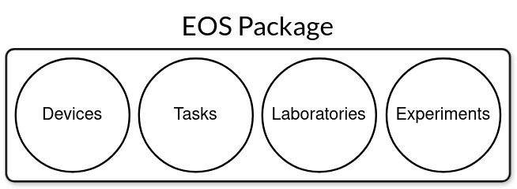
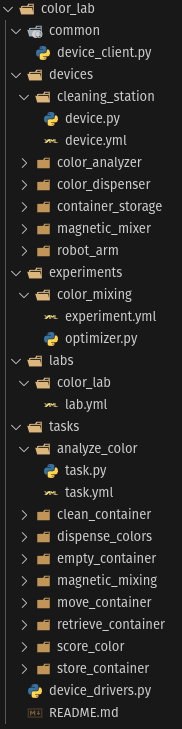

Packages
========
Code and resources in EOS are organized into packages, which are discovered and loaded at runtime.
Each package is essentially a folder. These packages can contain laboratory, device, task, and experiment definitions,
code, and data, allowing reuse and sharing across the community. For example, a package can contain task and device
implementations for equipment from a specific manufacturer, while another package may only contain experiments that
run on a specific lab.

Using a package is as simple as placing it in a directory that EOS loads packages from. By default, this directory
is called `user` and is located in the root of the EOS repository.

Below is the directory tree of an example EOS package called "color_lab". It contains a laboratory called "color_lab",
an experiment called "color_mixing", and various devices and tasks. It also contains additional files
such as a Python script for launching low-level device drivers, a device client under `common`, and a README file.

Create a Package
----------------
.. code-block:: shell

   eos pkg create my_package

This command is a shortcut to create a new package with all subdirectories. Feel free to delete subdirectories you don't
expect to use.
