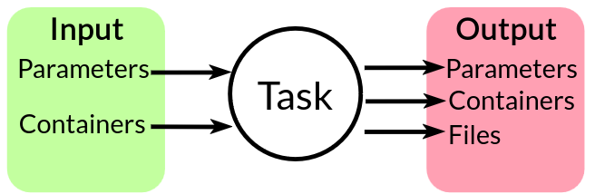

Tasks
=====
A task in EOS encapsulates an operation and can be thought of as a function.
Tasks are the elementary building block in EOS.
A task is ephemeral, meaning it is created, executed, and terminated.
A task takes some inputs and returns some outputs, and may use one or more devices.

There are two kinds of inputs: **parameters** and **containers**.

#. **Parameters**: Data such as integers, decimals, strings, booleans, etc that are passed to the task.
#. **Containers**: Vessels that may contain one or more samples.

There are three kinds of outputs: **parameters**, **containers**, and **files**.

#. **Parameters**: Data such as integers, decimals, strings, booleans, etc that are returned by the task.
#. **Containers**: Vessels that may contain one or more samples.
#. **Files**: Raw data or reports generated by the task, such as output files from analysis.

Parameters
----------
Parameters are values that are input to a task or output from a task.
Every parameter has a specific data type.
EOS supports the following parameter types:

* **int**: An int number.
  Equivalent to Python's ``int``
* **float**: A float number.
  Equivalent to Python's ``float``
* **str**: A str (series of text characters).
  Equivalent to Python's ``str``
* **bool**: A true/false value.
  Equivalent to Python's ``bool``
* **choice**: A value that must be one of a set of predefined choices.
  The choices can be any type.
* **list**: A list of values of a specific type.
  Equivalent to Python's ``list``.
* **dict**: A dict of key-value pairs.
  Equivalent to Python's ``dict``.

Tasks can have multiple parameters of different types.
EOS will ensure that the parameters passed to a task are of the correct type and have values that meet their constraints.

Containers
----------
Containers are referenced by a unique identifier called a **container ID**.
A container ID is a str that uniquely identifies a container.
Every container in EOS must have an ID, and these can be specified in the laboratory definition.
Containers are treated as *global* objects and can move across labs.
However, every container must have a "home" lab from which it originates.

In order to pass a container to a task or return a container from a task, its container ID is used.
Every task may accept specific types of containers, such as beakers, or vials.
Multiple different containers can be passed.
Users can create their own types of containers, such as ``beaker_500ml`` or ``vial_2ml``, which specify a unique container type.
EOS will ensure that only container types that are compatible with the task are passed to it.

Files
-----
Files may be generated by a task and EOS will store them in an object storage (MinIO).
Output files can be used to record raw data for future reference, and can be downloaded by the user.

.. note::
    Files cannot currently be passed as inputs to tasks via the EOS runtime and its object storage.
    This is planned to be supported in the future.
    It is still possible to pass them using an external object storage (e.g., MinIO), but this has to be implemented and
    managed manually.

Task Implementation
-------------------
* Tasks are implemented in the `tasks` subdirectory inside an EOS package
* Each task has its own subfolder (e.g., tasks/magnetic_mixing)
* There are two key files per task: ``task.yml`` and ``task.py``

YAML File (task.yml)
~~~~~~~~~~~~~~~~~~~~
* Specifies the task type, desc, and input/output parameters and containers
* Acts as the interface contract (spec) for the task
* This contract is used to validate tasks, and EOS enforces the contract statically and dynamically during execution
* Useful as documentation for the task

Below is an example task YAML file for a GC analysis task for GCs made by SRI Instruments:

:bdg-primary:`task.yml`

.. code-block:: yaml

    type: SRI GC Analysis
    desc: Perform gas chromatography (GC) analysis on a sample.

    device_types:
      - sri_gas_chromatograph

    input_parameters:
      analysis_time:
        type: int
        unit: seconds
        value: 480
        desc: How long to run the GC analysis

    output_parameters:
      known_substances:
        type: dict
        desc: Peaks and peak areas of identified substances
      unknown_substances:
        type: dict
        desc: Peaks and peak areas of substances that could not be identified

The task specification makes clear that:

* The task is of type "SRI GC Analysis"
* The task requires a device of type "sri_gas_chromatograph".
  EOS will enforce this requirement.
* The task takes an input int parameter ``analysis_time`` in seconds.
  It has a default value of 480, making this an optional parameter.
* The task outputs two dictionaries: ``known_substances`` and ``unknown_substances``.

Parameter Specification
"""""""""""""""""""""""
Parameters are defined in the ``input_parameters`` and ``output_parameters`` sections of the task YAML file.

Below are examples and descriptions for each parameter type:

Integer
"""""""
.. code-block:: yaml

    sample_rate:
      type: int
      desc: The number of samples per second
      value: 44100
      unit: Hz
      min: 8000
      max: 192000

Integers must have a unit (can be n/a) and can also have a minimum and maximum value.

Float
"""""
.. code-block:: yaml

    threshold_voltage:
      type: float
      desc: The voltage threshold for signal detection
      value: 2.5
      unit: volts
      min: 0.0
      max: 5.0

Decimals must have a unit (can be n/a) and can also have a minimum and maximum value.

String
""""""
.. code-block:: yaml

    file_prefix:
      type: str
      desc: Prefix for output file names
      value: "experiment_"

Boolean
"""""""
.. code-block:: yaml

    auto_calibrate:
      type: boolean
      desc: Whether to perform auto-calibration before analysis
      value: true

Booleans are true/false values.

Choice
""""""
.. code-block:: yaml

    column_type:
      type: choice
      desc: HPLC column type
      value: "C18"
      choices:
        - "C18"
        - "C8"
        - "HILIC"
        - "Phenyl-Hexyl"
        - "Amino"

Choice parameters take one of the specified choices.

List
""""
.. code-block:: yaml

    channel_gains:
      type: list
      desc: Gain values for each input channel
      value: [1.0, 1.2, 0.8, 1.1]
      element_type: float
      length: 4
      min: [0.5, 0.5, 0.5, 0.5]
      max: [2.0, 2.0, 2.0, 2.0]

List parameters are a sequence of values of a specific type.
They can have a specific length and minimum and maximum per-element values.

Dictionary
""""""""""
.. code-block:: yaml

    buffer_composition:
      type: dict
      desc: Composition of a buffer solution
      value:
        pH: 7.4
        base: "Tris"
        concentration: 50
        unit: "mM"
        additives:
          NaCl: 150
          KCl: 2.7
          CaCl2: 1.0
        temperature: 25

Dictionaries are key-value pairs. The values can be any type.

Python File (task.yml)
~~~~~~~~~~~~~~~~~~~~~~
* Implements the task
* All task implementations must inherit from ``BaseTask``

:bdg-primary:`task.py`

.. code-block:: python

    from eos.tasks.base_task import BaseTask

    class MagneticMixing(BaseTask):
        async def _execute(
            self,
            devices: BaseTask.DevicesType,
            parameters: BaseTask.ParametersType,
            containers: BaseTask.ContainersType,
        ) -> BaseTask.OutputType:
            magnetic_mixer = devices.get_all_by_type("magnetic_mixer")[0]
            mixing_time = parameters["mixing_time"]
            mixing_speed = parameters["mixing_speed"]

            containers["beaker"] = magnetic_mixer.mix(containers["beaker"], mixing_time, mixing_speed)

            return None, containers, None

Let's walk through this example code:

``_execute`` is the only required function in a task implementation.
It is called by EOS to execute a task.
The function takes three arguments:

#. ``devices``: A data structure supporting lookup of specific lab devices assigned to a task.
   In this case, only one device is given, a magnetic mixer.
   The devices are represented as wrappers to Ray actor references, and the task implementation can call functions from
   the device implementation.
#. ``parameters``: A dictionary of the input parameters.
   Keys are the parameter names and values are the parameter values.
#. ``containers``: A dictionary of the input containers.
   Keys are the container IDs and values are the ``Container`` objects.
